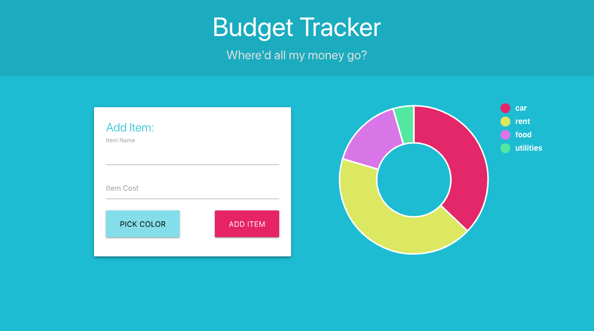
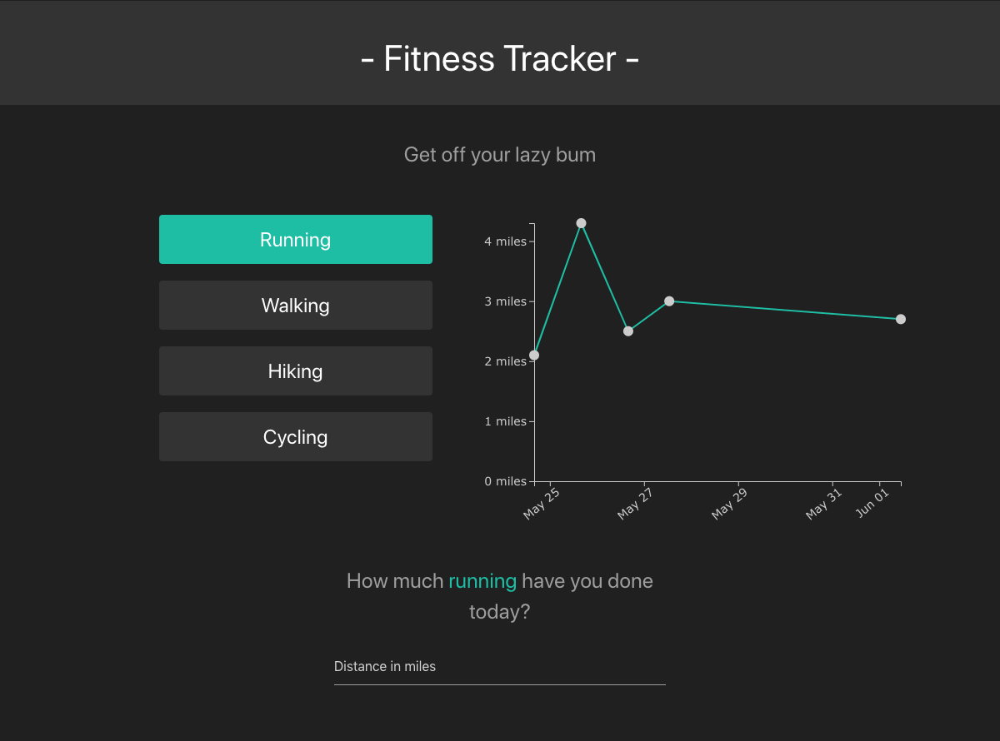
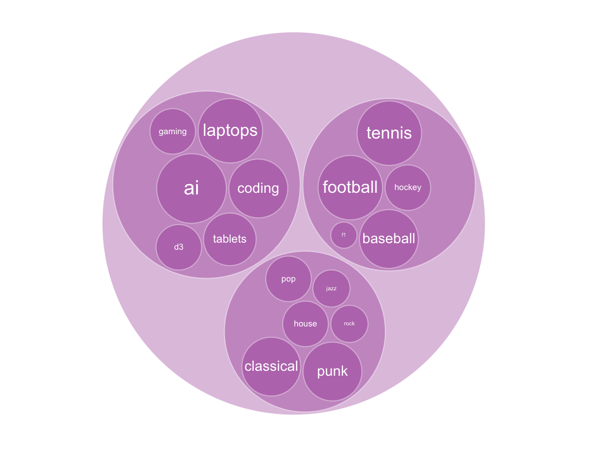
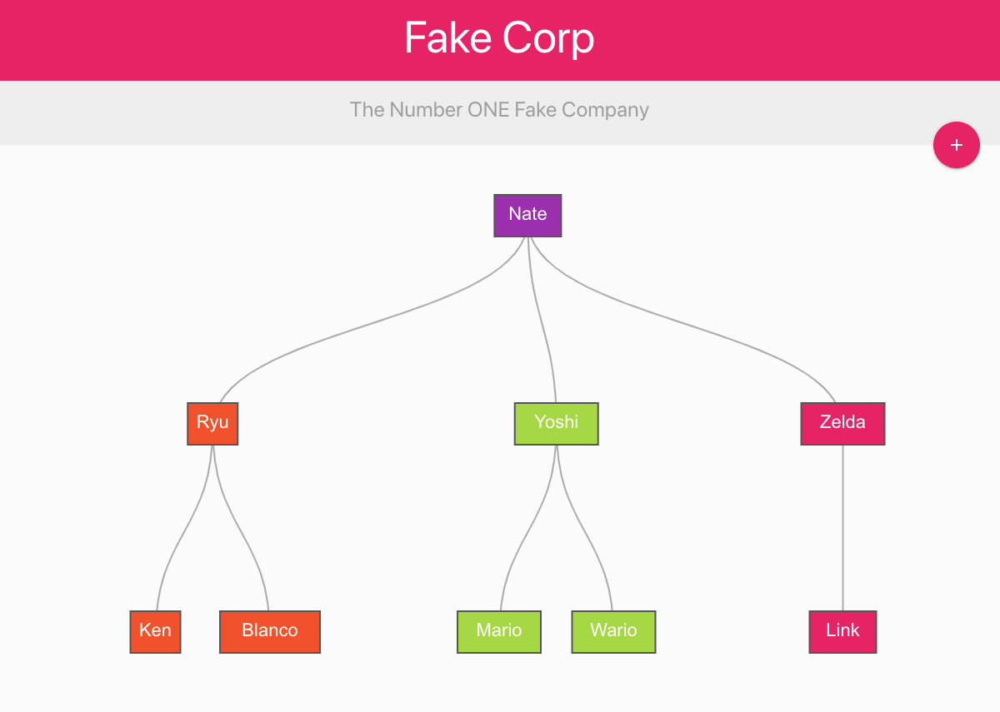

# D3.js with Firebase

Four projects to learn the fundamentals of D3.js, utilizing Firebase's Firestore
to supply real time data.

## Projects:

### Budget Tracker -- Donut Chart

- #### View a [working demo](https://donut-chart-nds.netlify.com/)
- Arc path generator
- Enter and exit selection transitions / tweens
- Ordinal scales
- Legend and arc info on hover

 

---

### Fitness Tracker -- Line Graph

- View a [working demo](https://line-graph-nds.netlify.com/)
- Line path generator
- Filtering data
- Time scales and axes groups
- Data point hover effects

 

---

### Data Hierarchy -- Bubble Pack

- Non-interactive
- Stratification of hierarchical data
- Bubble pack generator

 

---

### Fake Corp -- Tree Diagram

- View a [working demo](https://tree-diagram-nds.netlify.com/)
- Tree and link path generators
- Stratification of hierarchical data
- Ordinal color scale

